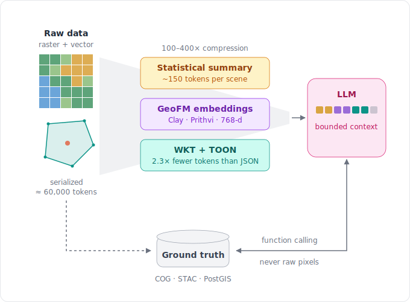

# rster4llm

A concept architecture for making raster and vector geospatial data usable by Large Language Models — without sending raw pixels or bulky spatial objects into the context window.

> **Status: concept repository.** This project documents a *proposed* architecture and the research behind it. Nothing here is implemented: there is no package, no production code, and no benchmark has been run in this repository. All quantitative figures below are estimates reported by the source literature reviews, not measurements made here.

*The proposed flow at a glance. The compression figure in the diagram is a literature-reported estimate.*

## The problem

LLMs operate on a bounded window of text tokens. Geospatial data, serialized naively, does not fit:

- **Rasters are too large.** A single Sentinel-2 scene contains millions of multi-band pixels. Serializing even one 256×256 RGB tile as text costs on the order of tens of thousands of tokens — a large share of a typical context window for a tiny fraction of one scene, with no semantics gained.
- **Coordinates fragment.** Sub-word tokenizers split a pair like `(-122.4194, 37.7749)` into arbitrary pieces. Numerical adjacency is lost: nothing tells the model that 37.7749 is spatially next to 37.7750.
- **Verbose formats add noise.** GeoJSON repeats structural keys (`"type": "Feature"`, `"geometry"`) for every feature; the repetition consumes tokens and dilutes attention over the values that matter.
- **Meaning lives around the data.** Topology (adjacency, containment), coordinate reference systems, and physical units are implicit in GIS practice — and silently lost in naive text dumps.
- **Direct image input is not a free pass.** Multimodal LLMs accept imagery, but mainstream vision encoders are trained on natural photos rather than nadir multispectral data. Reported weaknesses include imprecise coordinate extraction, weak quantitative measurement, and hallucinated map features.

## The proposed approach

One principle: **put meaning into the context window, and keep full-fidelity data outside it — reachable through verifiable tool calls.**

Five conceptual components serve that principle:

1. **Statistical summaries (rasters → ~10² tokens).** Pre-compute per-band statistics (mean, deviation, percentiles), histograms, and derived indices (e.g., NDVI), optionally aggregated by zone. The reviewed literature suggests a full scene can be represented for many analytical purposes in roughly 100–150 tokens. For digital soil mapping, covariate summaries can be organized along SCORPAN dimensions.
2. **Geospatial foundation model (GeoFM) embeddings.** Models such as Clay, Prithvi-EO and SatCLIP encode image chips (e.g., 256×256 pixels) into dense vectors (~768-d). These never enter the prompt; they enable similarity search and retrieval — "find areas like this one" — at a fraction of raw-data cost.
3. **Compact serializations for vectors.** WKT for geometries (reported ~2× fewer tokens than equivalent GeoJSON); compact tabular forms (CSV, or the experimental TOON) for attribute tables; physical units always explicit in the text.
4. **Hybrid spatial–semantic retrieval.** Retrieval that filters spatially (PostGIS predicates, H3 cells) and ranks semantically (vector similarity), fusing both rankings — e.g., via Reciprocal Rank Fusion. Recent literature calls this pattern Spatial-RAG.
5. **Function calling over ground truth.** The original data stays in cloud-native formats (COG, GeoParquet, Zarr) under a STAC catalog and/or a spatial database. The LLM requests computed results — catalog search, zonal statistics, point queries — and never receives raw pixels. Every answer remains traceable to its source. The intended role is decision support, not automated decision-making.

## Proposed architecture

A tiered pipeline — proposed, not built:

| Tier | Role | Candidate components |
|------|------|----------------------|
| 1. Raw storage | Full-fidelity ground truth | COG, GeoParquet, Zarr; STAC catalog |
| 2. Embeddings | Similarity search over space | Clay / Prithvi-EO / SatCLIP chips → vector store, H3-indexed |
| 3. Summaries | LLM-readable descriptions | Per-band stats, histograms, derived indices as STAC properties or sidecar JSON |
| 4. Retrieval & tools | The only layer the LLM touches | Hybrid spatial + semantic queries; a small read-only tool surface (search, summarize, zonal stats, point query) |

The tiers decouple deliberately: a better foundation model can replace Tier 2 without touching Tier 1, and a different LLM can consume Tiers 3–4 unchanged.

## Source material

The concept is distilled from three deep-research syntheses produced independently with different AI research assistants, all asked the same question. Their convergence on essentially the same architecture is the main reason to take the direction seriously — but they are literature reviews generated by LLMs and should be read critically.

| Document | Produced with |
|----------|---------------|
| [Optimal Spatial Data Ingestion for LLMs — A Technical Synthesis](Resources/Optimal%20Spatial%20DataIngestion%20for%20LLMs%20--A%20Technical%20Synthesis%20by%20Claude.md) | Claude |
| [Architecting the Spatial-Semantic Bridge](Resources/Optimal%20Spatial%20Data%20Ingestion%20for%20LLMs%20by%20Gemini.md) | Gemini |
| [Optimal Data Formats for Spatial Data Ingestion into LLMs](Resources/Optimal%20Data%20Formats%20for%20Spatial%20Data%20Ingestion%20into%20LLMs%20by%20ChatGPT.md) | ChatGPT |

## How this could be implemented

Design guidance for a future implementation — intentionally not implemented here:

- **Summaries.** GDAL/rasterio can produce per-band statistics and histograms cheaply as a post-processing step of an existing raster pipeline; store the results as STAC Item properties or sidecar JSON next to each COG.
- **Storage and catalog.** COG and GeoParquet are mature; Zarr fits multidimensional cubes. A static STAC catalog is enough to start; `stac-fastapi` with `pgstac` adds search capability later.
- **Embeddings.** Clay / Prithvi-EO inference needs GPU time for the initial pass; SatCLIP location embeddings are cheap by comparison. Store one embedding per chip, tagged with an H3 cell id for spatial filtering.
- **One database, not two.** PostgreSQL with PostGIS + pgvector keeps spatial filtering and vector ranking in a single query plan and avoids synchronizing a separate vector store with the spatial database.
- **Tool surface.** A small read-only set of functions — `search_layers`, `get_layer_summary`, `zonal_stats`, `point_query` — exposed via MCP or plain function-calling schemas. Responses serialized compactly (WKT geometries, CSV-like tables). A SELECT-only database role limits the blast radius.
- **Decide first.** Target LLM(s) (text-only vs multimodal), scale (one region vs global), the evaluation dataset and questions, summary granularity (scene vs tile vs H3 cell), and the CRS policy for measurements.

## Possible future roadmap

Phased and conditional — each phase is worth doing only if the previous one validates:

1. **Evaluation design.** Assemble a small benchmark: a few rasters and vector layers plus ground-truth question–answer pairs.
2. **Summary prototype.** Generate statistical summaries for the benchmark; measure token cost versus answer fidelity against naive serialization.
3. **Retrieval experiment.** Hybrid spatial–semantic retrieval (PostGIS + pgvector + rank fusion) over the same data.
4. **Tool-calling specification.** Define the read-only tool surface and test it end-to-end with an agent.
5. **GeoFM embeddings.** Add chip embeddings; compare retrieval quality against the summaries-only baseline.
6. **Case study.** Integrate into a real spatial data infrastructure — for example, a national soil information system node.

## Limitations and open questions

- All quantitative figures here (token counts, compression ratios, accuracy numbers) come from the secondary syntheses; none were measured in this repository. Citations inside the source documents should be verified before being relied upon.
- TOON is an experimental format with no standardization; plain CSV may be the pragmatic choice.
- GeoFM embeddings are trained mostly on optical imagery; transfer to non-imagery covariates (DEM derivatives, gamma radiometrics) is unproven.
- How much task-relevant information statistical summaries lose — and at which spatial granularity they should be computed — is unmeasured.
- CRS and precision policy is unresolved: WGS 84 simplifies exchange but distorts measurement; projected CRS complicates serialization.
- Grounding reduces but does not eliminate hallucination, and there is no agreed evaluation methodology for geospatial LLM answers.
- Cross-lingual retrieval (metadata in one language, queries in another) is assumed from general embedding behavior, not tested in this context.

## License and feedback

This work is licensed under the [Creative Commons Attribution 4.0 International (CC BY 4.0)](LICENSE) license. You may share and adapt the material for any purpose, provided you give appropriate credit — suggested attribution: "rster4llm by Marcos Angelini (angelini75), CC BY 4.0".

Questions, critiques, and pointers to related work are welcome via issues.
